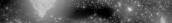
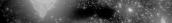
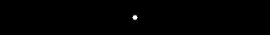
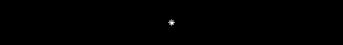
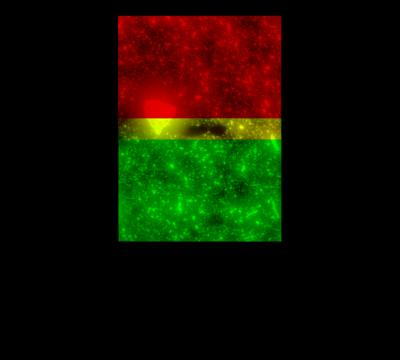
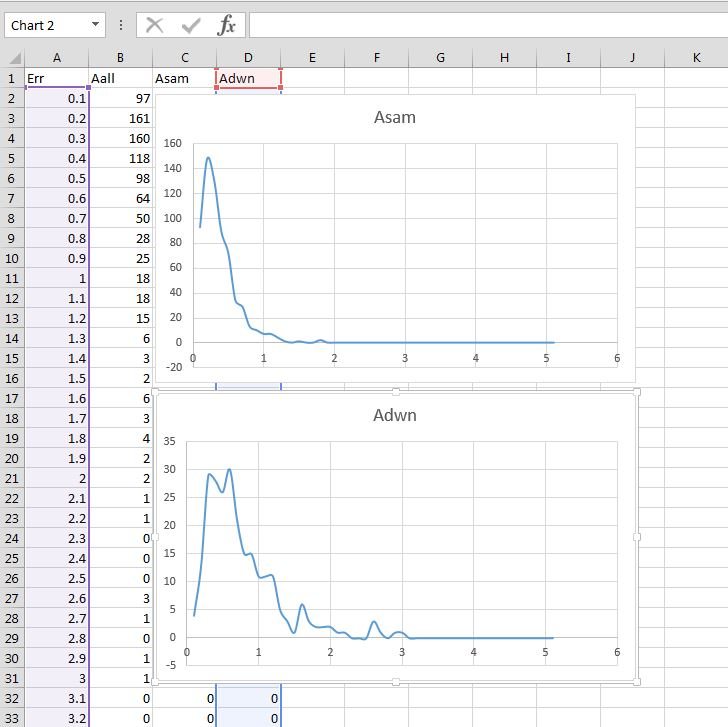

# Alignment Tutorial

**_I assume you've already forked and built the serial section aligner:_** [Alignment_Projects](https://github.com/billkarsh/Alignment_Projects). This companion repository comprises images, parameters, and everything else needed to thoroughly demonstrate and explain proper use of the aligner.

**Document organization:**

* [Basic Alignment Plan](tutorial.md#basic-alignment-plan)
* [These Data](tutorial.md#these-data)
* [DEMO Project Setup](tutorial.md#demo-project-setup)
* [Parameters](tutorial.md#parameters)
* [topgo.sht](tutorial.md#topgo)
* [dbgo.sht](tutorial.md#dbgo)
* [mongo.sht](tutorial.md#mongo)
* [Try Folder (ptestx)](tutorial.md#try-folder-ptestx)
* [Extract Same-layer Points](tutorial.md#extract-same-layer-points)
* [Solve Montages](tutorial.md#solve-montages)
* [Create Cross-layer Work Folder](tutorial.md#create-cross-layer-work-folder)
* [Run Coarse Strip-Strip Alignment](tutorial.md#run-coarse-strip-strip-alignment)
* [Review Strip-Strip Alignment](tutorial.md#review-strip-strip-alignment)
* [Create Coarse Scaffold](tutorial.md#create-coarse-scaffold)
* [Run Block-Block Alignment](tutorial.md#run-block-block-alignment)
* [Extract Cross-layer Points](tutorial.md#extract-cross-layer-points)
* [Solve Final Stack](tutorial.md#solve-final-stack)
* [Undo](tutorial.md#undo)

## <a name="basic-alignment-plan"></a>Basic Alignment Plan

### Step-wise Workflow

* It's a pipeline of components.
* Edit/Run a script to drive a component/step.
* Read the output files and logs to check for errors.
* Edit/Run the next script, and so on.

Much of the job is editing scripts or looking at scripts to see what the params/conditions are/were. To that end I create my bash scripts with extension `*.sht` for 'shell text.' I set my visual NX environment file mapping so double-click on 'sht' opens it in kwrite. I run with the usual:

```
> ./script.sht
```

**Cautions:**

* Each script is a checkpoint, a natural place to: synchronize, think, reconsider, intervene, continue.
* Sanity checking each step is critical. Stuff fails. The later you wait to discover an error the harder it is to find it, understand it or fix it.
* Making a script to merely run other scripts without human checkpoints is foolish.

### The Algorithm in a Nutshell

#### Make Montages

That means align data within each layer without regard to any other layers. This process is very parallel. It also works very well because (**this is key**) it's exactly the same content, just imaged twice. It really does match. Cross layer stuff isn't really the same stuff so the matching is essentially a hack.

To make montages we survey the initial layout file and use the starting affines to estimate overlap. If overlap exceeds a threshold we add that pair of images to a make file `make.same`. These make files will be submitted to the cluster. Each rule in the make is a pair of images.

Each pair in the make file is given to program `ptest`. The code for ptest is in 1_DMesh. OK, these names are imperfect. They are holdovers from the original Lou code. I kept the names so Lou could navigate his way through the new organization.

Program ptest uses the parameters in `matchparams.txt` to work on two images + an initial guess at the relative affine. The images are intensity normalized, background subtracted, possibly filtered and reduced in size. A thumbnail match (affine) is found using FFTs. If no match is validated, the image pair is discarded and they are not connected...

...Otherwise in the intersection region we next erect a single triangle and express the pixels of image A in those coords. The triangle is deformed using gradient descent to improve the match to B in that region. If we can't get a signal (correlation R) over threshold we fail. Otherwise, go on...

...Next ptest overlays a grid of smaller triangles in the intersection. Again gradient descent is used to deform A relative to B. The centroids of those triangles become the 'features' that are reported as correspondence point pairs in many files called `pts.same` or `pts.down`. In the end we will have a grand system of many affines to solve for and correspondence point pairs ('points' for short) that connect them.

The montage step generates the pts.same files, but to do cross-layer matching we have to figure out the gross angle between layers which might be anything [-180,180] because the slice pickup process can be messy.

#### Strip Matching

After montages are made we render them reduced by something like 50X. We also cut a horizontal strip from each and try all angles matching to a vertical strip cut from the montage below. This makes the FFT quicker and captures most of the expected intersection region. The strip matching makes rigid transforms that we use to make a reduced size TrakEM2 stack that can be checked. Any errors in strip alignment can be fixed using TrakEM2 `Align with manual landmarks.` The result of that process is sent to the next step.

We scale the fixed stack back up to full size. The affines are collected and will serve as the starting guesses for the final grand solve.

#### Block Matching

We also refine the layer-layer matching by carving each layer into several blocks (neighborhoods). These are matched at reduced size to the tissue below. The reduced size squeezes out neuropil and emphasizes big stuff like blood vessels and somata. These block matches tell us which images from layer A pair with those from layer B. The matches also yield affines that are the starting guesses for the ptest jobs (collected in `make.down`).

#### Extracting Cross-layer Points

Program ptest works for cross layer image pairs just like same layer pairs. The big deal about guesses is that the thumbnail matching is done with FFT images of normalized cross correlation in which we are scanning for a peak. But there are many possible distractor peaks. We use the guess from the block matching to create a mask for the correlation image. We only look for the peak in a disc about the guess. This works very nicely. These ptest jobs make the `pts.down` files.

#### Grand Solve

The last step is to invoke the grand LSQ solver to sweep up all the points and spit out tables of affines.

## <a name="these-data"></a>These Data

These fluorescence imaging data are **three consecutive sections** of 200 nm thick mouse tissue. Each slice is about 170 x 450 um. The label is antibody-stained YFP expressing in cortical layer five pyramidal cells of a Thy-1 mouse. Sample preparation, slicing and microscopy were performed by [Jong-Cheol "J. C." Rah](http://journal.frontiersin.org/Journal/10.3389/fncir.2013.00177/abstract) here at Janelia. My wife Jennifer Colonell and I (members of the [Applied Physics and Instrumentation Group](http://janelia.org/lab/harris-lab-apig)) had built a system to do optical array tomography in the manner of [Stephen Smith](http://www.hms.harvard.edu/bss/neuro/bornlab/nb204/papers/micheva_smith_2007.pdf). J. C. was the first biologist to bravely employ our platform for a major research project.

**Arrangement of tile-ids in each montage:**

```
13   0
12   1
11   2
10   3
 9   4
 8   5
 7   6
```

Each slice is tiled by **14 images arranged in a 2 X 7 grid. Each image tile is 1376 X 1040 pixels**. This is an exceedingly tiny excerpt from the whole sample, but that does not diminish its utility as a demonstration of the method. The lessons learned here apply as well to EM data and to samples of any size. By the way, this happens to be the first sample I shopped around the building, looking for an expert who would take alignment off my plate altogether (none answered the call). It's the same sample I used to tease apart how Lou's thing worked and to figure out what I would need to change for optical data. I've realigned this sample hundreds of times to test major code revisions. Though I have aligned dozens of data sets, this one remains my favorite.

## <a name="demo-project-setup"></a>DEMO Project Setup

The tutorial repo's `StarterMaterials` folder contains everything needed to create the "DEMO" project workspace. Note that the image files (in TIF) are never modified by the aligner so there's no need to copy them out of the repo.

You'll create a local project folder and align these data step by step as described here. Each step generates more and more data, logs and reports in various project subfolders. I'll have done the same and periodically I'll add another folder to the repo showing what I have to that point.

Follow these steps to get started:

### Make a Copy

Keep your repo virgin so you can compare what you've done against what I did. Create a separate project folder (**_not in the repo_**) called `DEMO` and populate it with these StarterMaterials items (everything but TIF):

* `prms` : the two needed parameter files
* `edit_filepath.sht` : sets absolute image paths
* `reformatgo.sht` : converts to new preferred format
* `rick0.txt` : old-style image metadata **_layout file_**
* `topgo.sht` : first alignment script

### Older 'Rick' Layout Format

Our starter layout file 'rick0.txt' is provided in a primitive file format (locally we call it [Rick Fetter](http://janelia.org/people/scientist/richard-fetter), or just "Rick" format). It contains the bare minimum information needed for each image tile:

```
absolute_rooted_image_path X_float Y_float Z_integer_index
```

* Full absolute path to image.
    * Images may be accessed from a variety of working directories so must be absolute.
    * Images can be TIF (8,16) PNG (8,16) MRC(16).
* X, Y are floating-point coordinates of image's left-top corner.
    * X increases from left to right.
    * Y increases from top to bottom.
    * Arrangement is arbitrary; requirement is adequate overlap to match content.
* Z is 0-based layer index.
    * All the images for a layer should be grouped together in a layout file.
    * Listed Z's should never decrease.
    * Z's need not be contiguous: we will automatically match across gaps.
    * Z need not start at 0 (set desired `-z=i,j` range in topgo.sht).
* The image-id (a.k.a. tileid) must be embedded in the image filename. There is no other field provided for the id.
    * TileID is a non-negative 32-bit integer and is unique within its layer.
    * `Tip: ID's can be anything, but assigning, say, col*1000+row, makes navigating easier`.

The aligner (`a.k.a. pipeline`), per se, no longer supports this simple format directly, but you may appreciate knowing that you could create a simple meta-file like this and then convert to the new format, as we show here.

First though, note that the paths in rick0 are not the required absolute paths. Rather the images are prefixed with "editme" (try `> cat rick0.txt`). To fix this, note (or copy) the full rooted path to your repo's TIF folder, and type (substituting your path):

```
> ./edit_filepath.sht rick0.txt 'editme' '/groups/apig/tomo/Alignment_Tutorial/StarterMaterials/TIF`
```

The output is `.../DEMO/rick0_v2.txt` with absolute paths that make sense on your computer.

### New 'Bill' Layout Format

Next we convert rick0_v2.txt to the new proper format using `.../Alignment_Projects/1_Reformat/reformatgo.sht`. We've already copied that script into the demo so it's ready to run:

```
> ./ reformatgo.sht
```

* This creates output file `rick0_v2_v2.txt`. **_>>> Please rename it to `layout.txt`. <<<_**
* It also makes a hopefully uninteresting `Reformat.log`. Open that just in case you have some build or PATH issue, then you can delete it.

The Bill layout does not use meta data in filenames. Rather, each piece of meta data we've found helpful is a separately specified field:

```
Z tileID a00 a01 a02 a10 a11 a12 col row cam full_path
```

* Z is 0-based layer index.
    * All the images for a layer should be grouped together in a layout file.
    * Listed Z's should never decrease.
    * Z's need not be contiguous: we will automatically match (bridge) across gaps.
    * Z need not start at 0 (set desired `-z=i,j` range in topgo.sht).
* TileID is a non-negative signed 32-bit integer and is unique within its layer.
    * `Tip: ID's can be anything, but assigning, say, col*1000+row, makes navigating easier`.
* Components of affine with 2D order like this:
    * `.[ [a00 a01 a02]`
    * `.. [a10 a11 a12] ]`.
    * Equiv 1D labeling like this: [a0 a1 a2 a3 a4 a5] = [a00 a01 a02 a10 a11 a12].
    * Most often, [a0 a1 a3 a4] = identity [1 0 0 1] and [a2 a5] = image [left top].
* col and row are 0-based col and row indices for human debugging.
    * If unavailable, these should be set each to -999.
* cam is 0-based camera identifier for debugging.
    * In a one-camera setup, use cam = 0.
* Full rooted absolute path to image.
    * Images may be accessed from a variety of working directories so must be absolute.
    * Images can be TIF (8,16) PNG (8,16) MRC(16).
* Spaces are space or tab.

### Layout From TrakEM2 File

As an alternative to the new-style text layout file you can start the process (parameter to topgo.sht) with a TrakEM2 file (extension .xml), iff the XML file has our new-style XML format. To elaborate on that, the traditional TrakEM2 format already has support for these data:

* `z` : via tag `project::t2_layer_set::t2_layer::z`.
* `transform` : via `t2_patch::transform`.
* `path` : via `t2_patch::file_path`.

It lacks any designated fields to specify:

* `tileid`
* `cam`
* `row`
* `cam`

All the XML files that I write encode these extra fields into the `title` tag (traditionally the title simply repeats the image filename sans path). The title is never parsed by TrakEM2 software, so we are free to co-opt it for our meta-data. If all of the above extra fields are legitimate when I write an XML file, then I write the title field with pattern: `z.id-rgn_col.row.cam`. On the other hand, if the col value for the tile is unknown (col = -999) then an output title field is formatted as `z.id-rgn`.

So, if you have a TrakEM2 file that the pipeline has generated, you can name that in the topgo.sht script. If you have a traditional TrakEM2 file, you can convert it to a new-style TrakEM2 file using the `reformat` tool, provided that the tileid values are encoded in the old-style image names (in the title tags). Of course, the {col, row, cam} fields aren't in the traditional XML file, so we set them to defaults {-999, -999, 0}. Compose a reformatgo.sht command line like this:

```
reformat myoldfile.xml -x -p=_idN -zmin=i -zmax=j

// -p=pattern specifies where the tileid value 'N' is within the title string.
// e.g., -p=_idN specifies that the tileid follows text "_id".
// e.g., -p=_N_ specifies that the tileid is bracketed by two underscores.
```

### Recap

To recap, the typical starting project materials are really these:

* `DEMO` : project folder
    * `prms` : the two needed parameter files
    * `layout.txt` : new-style image metadata (or new-style TrakEM2.xml)
    * `topgo.sht` : first alignment script

## <a name="parameters"></a>Parameters

A light duty "justification" for each setting we use. Note that some parameters may be estimable by some argument and I'll try to give some insight for those, but others may not have a rationale, rather, they are determined only through trial and error.

### prms/matchparams.txt

**Image params**

* `PXBRO=2` : Most stages have some tilt, justifying order 1. In our case we've apertured the illumination to avoid bleaching adjacent fields, but this causes a bit of fall-off from center to edge, captured adequately by order 2.
* `PXLENS=N` : Not using deprecated affine lens correction file.
* `PXRESMSK=N` : Applicable only for EM.
* `PXDOG=N` : Difference of Gaussians filter never used. (N) disables parameters:
    * `PXDOG_R1=3`
    * `PXDOG_R2=6`
* `FLD=N` : Not using foldmasks.
* `PRETWEAK=N` : Optical data typically not distorted.
* `SCALE=1` : No forced distortion needed.
* `XSCALE=1` : No forced distortion needed.
* `YSCALE=1` : No forced distortion needed.
* `SKEW=0` : No forced distortion needed.

**Thumb params**

* `MODE_SL=M` : Preferred mode: assume reliable stage coords and zero angle between in-layer tiles.
* `MODE_XL=N` : Preferred mode: get Tab from the block-block alignment.
* `TAB2DFM_SL=N` : Assume no image distortion.
* `TAB2DFM_XL=Y` : Adopt Tab as is from block-block, including non-rotation parts.
* `XYCONF_SL=1.0` : We have accurate stage, vote full confidence, maximum cropping.
* `XYCONF_XL=0.8` : In the cross-layer case the Tab comes from block matching which is excellent in this data set, but because there is actual content change between layers I am hesitant to declare it perfect so I back off a little. If you think there is a lot of uncertainty in the block matching then you would lower the confidence further to allow more latitude in translation of A against B. At the same time you would increase LIMXY_XL a bit to allow peaks to be searched farther from the expected location. You would probably do this adjustment while watching the effect in ptestx. There is a downside to making these confidences lower than they should be and it stems from that increased translation latitude. Quite simply, that makes more opportunities to match inappropriate features, basically defeating the external guidance that block matching provides. It admits more error to creep in.
* `THMDEC_SL=8` : Take a look at stage coords in layout file. `A1_13_2.tif 0 0 0` vs `A1_0_2.tif 1142 0 0`. These two are on same row. A0 to the right of A13. Overlap is 1376 - 1142 = 234 pixels. A reduction in scale by 8 still gives us ~30 pixels of overlap for FFT matching which is enough considering the feature density in these images. Similar analysis gives about 1040 - 857 = 183, divided by 8 = 23 pixels row-row. Still good.
* `THMDEC_XL=8` : Again, feature density supports this much reduction.
* `OLAP1D_SL=0` : Minimum required overlap between A and B can be expressed as 1D or 2D thresholds or both. For example you may know that your images have 10 pixels of garbage at the edge so a 1D spec is useful. For this case, we make area arguments.
* `OLAP1D_XL=0` : Ditto.
* `OLAP2D_SL=60000` : I don't want corner-corner overlaps because they are just a little too small for comfort. Those are about 234 X 183 = 42822, so I round up to a neat 60000 to exclude them.
* `OLAP2D_XL=160000` : Tissue is actually different between layers so I want a bigger patch to work on than same-layer. Looking at feature density, I'm judging I want patches something like 400 X 400 = 160000 or so.
* `NBMXHT_SL=0.75` : We are using S-type correlation, so F-params not applicable.
* `NBMXHT_XL=0.75` : Ditto.
* `HFANGDN_SL=5` : Not using angle sweep mode; not applicable.
* `HFANGDN_XL=45` : Ditto.
* `HFANGPR_SL=1` : Ditto.
* `HFANGPR_XL=4` : Ditto.
* `RTRSH_SL=0.3` : Ultimately you'll have S-folders and you can 'cd' into those and type `grep "Approx: Returning" pair*` to see the actual R-values (really S-values) were getting. All are larger than 2.5. This threshold is very small considering our very clean data. The parameter serves as a minimum required correlation. For most kinds of data 0.3 is a reasonable low limit.
* `RTRSH_XL=0.3` : In the cross-layer case, we do get a few instances of R (S) near 0.3 because the slice thickness is 200 nm and content really is changing from layer-to-layer. We picked 0.3 here as a nominal guess. We would push it up if we had examined cases (using ptestx) that failed at the FFT stage because 0.3 was too permissive. We've already done that exercise and that's not an issue. So the "nominal" value is used...not critical.
* `TWEAKS=N` : FFT results (tr_guess) get us close enough to a good mesh starting point without fine adjustment; not needed.
* `LIMXY_SL=30` : Over thousands of images our stage is reliable to at least this. Later, in an S-folder try `grep "Approx: err" pair*` to see that actual error (difference between actual peak and Tab expectation) in this tiny sample is typically < 10 pixels.
* `LIMXY_XL=80` : The block-block matching works well and most of those errors are < 20 (try `grep "Approx: err" pair*` in D-folder). There is one image pair that needs a larger disc (2.4^1.3) so I've taken the 56 or so pixels for that case and added some margin. In my opinion though, 80 pixels is extremely tight. In a data set of any size several hundred pixels is the norm.
* `WTHMPR=Y` : Write summary ThmPair_a^b.txt FFT transform results.

**Mesh params**

* `OPT_SL=Y` : Allow the mesh optimizer to move control points around.
* `RIT_SL=0.50` : Remember that the mesh machinery measures simple correlation (full scale) so these values need not look like the FFT values (neither on thumbs nor retested on full scale images). I got this value by trying cases and then backing off a little. `RIT` is the correlation we require before the optimizer is permitted to run, `RFA` is the value for just one large triangle, `RFT` is the value for the full mesh. Note that we expect at least small improvement as we increase deformation freedom.
    * `RIT_XL=0.1` : Ditto, by experiment.
    * `RFA_SL=0.55` : Ditto, by experiment.
    * `RFA_XL=0.20` : Ditto, by experiment.
    * `RFT_SL=0.65` : Ditto, by experiment.
    * `RFT_XL=0.25` : Ditto, by experiment.
* `TMC=5` : In the full mesh, we permit 5% area variation among triangles. In fluorescence data triangles with extended bright content will change more than homogeneous dim features like neuropil. 5% is quite strict. 30% is not unheard of, especially if there are some folds and the mesh straddles different subregions.
* `TSC=9` : Total mesh change. Same remarks.
* `MNL=250` : Something like a dozen triangles on a side is typical, so I want six or so grid boxes per side. 1040 / 250 = 4.16 and the mesh algorithm will round it up to 5, giving 10 triangles. 1376 / 250 becomes 6 boxes, so 12 triangles.
* `MTA=120000` : This minimum size threshold is applied only in the XL case. As per the discussion in ["Notes on Mesh Creation"](https://github.com/billkarsh/Alignment_Projects/blob/master/00_DOC/ptest_reference.md#notes-on-mesh-creation), `F = 2 X E / R` and I believe R, the ratio of same-to-cross quality, should be 2-ish. Therefore, I want F = E ~ 12 triangles per face. That is, MTA = (1040 X 1376) / 12 ~ 120000. This is very rough. It's also close to my judgement for OLAP2D_XL.
* `MMA=60000` : This serves both same and cross layer so I'm setting it using the same argument as for OLAP2D_SL. The cross-layer triangles must still pass the stricter MTA requirement, so both cases are covered.
* `ONE=N` : Almost no reason to stop at the single-triangle mesh, unless debugging something.
* `IFM=0.50` : Use `EMM=Y`, Fourier metrics ignored.
* `FFM=0.65` : Use `EMM=Y`, Fourier metrics ignored.
* `FYL=0.5` : The yellow computes |A-B|/A for each pixel and counts how many are within some tolerance. We hadn't settled on a tolerance, so the pair*.log files tabulate results for several tolerances in range [1.05..1.25] but only result for 1.25 is tested against this threshold.
* `CPD=0.5` : Not used if `EMM=Y`.
* `EMM=Y` : Using earth mover's metric.
* `EMT=0.14` : Threshold 0.14 experimentally determined.
* `WDI=N` : Do not write the difference (A-B) images used for EMM.
* `LDA=0.2` : The next three thresholds determine how different triangles can be from each other {LDA = angular deviation in radians, LDR = deviation in matrix (sine-like) components, LDC = deviation in translation (coord-like) components}. These values are experimentally determined.
    * `LDR=0.1` : Ditto, by experiment.
    * `LDC=100` : Ditto, by experiment.
* `DXY=100` : Not using command line option `-XYexp=dx,dy` which would force affines to be within DXY of the expected translation.
* `WMT=N` : Rendered triangles not useful unless debugging in ptestx.
* `WTT=N` : Auxiliary text transform files not used.

#### How To Tune

Okay, so how does one really pick all these numbers?

* Create a small sample from your data, like this tutorial.
* Take a stab at the parameters based upon hand-waving arguments or similar data sets.
* Run same-layer point extraction, montages and mreport.
* Change directory into the worst-looking montage folder...
    * Read the lsqw_0.log for details.
    * Use ptestx on the biggest error cases to see what went wrong.
    * Run xview.sht and examine the montage in TrakEM2.
* Change directory into the corresponding S-folder(s).
* `grep FAIL pair* > xxx.txt` to tabulate reasons you're not getting points.
* Play with examples in ptestx to adjust matchparams.
* Delete temp0 and run it all again with new matchparams until you like it.
* Repeat as needed.

### prms/scriptparams.txt

** Cluster configuration**

* `slotspernode=16` : Each cluster node (machine) at Janelia has 16 cores and 128 GB RAM shared among them. Users (via qsub parameters) specify the number of required slots, where is slot is a virtual unit comprising 1 core and 128/16 GB RAM. It's an honor system. If a job requires N processors, request at least N slots. If the memory footprint is M, request enough slots to cover that.

**Image database (IDB) params**

* `usingfoldmasks=N` : As always, I recommend omitting foldmasks, for now.
* `croprectfile= ` : You can use this feature to mask the edges of images on a per-camera basis (see ["Rectangular Cropping Regions"]( https://github.com/billkarsh/Alignment_Projects/blob/master/00_DOC/ptest_reference.md#rectangular-cropping-regions)). We don't need that here.
* `makefmjparam=4` : This determines how many tiny.exe jobs can be run concurrently in script fsub.sht. Tiny.exe is used to generate foldmasks (which you don't need) or to convert mrc images to 8-bit TIFF for our pipeline (which you might). Set it based on the number of slots you are allowing per process (makefmslots), and the peak amount of memory tiny.exe jobs take (see `VmHWM` = high water mark, reported in logs).
* `makefmslots=4` : Script fsub.sht, via its make command, is issuing up to 4 concurrent jobs on a node, so we need the scheduler to request at least 4 slots just to get an adequate CPU count for our workload. We would request more than 4 slots if the memory load for the 4 jobs was greater than 4 slots worth (see `slotspernode` above).

**Montaging (same-layer)**

* `createauxdirs=N` : The auxiliary folders get images of triangles and text transforms (see `matchparams WMT, WTT`). We use that in the context of ptestx, which always creates those dirs in the temp folder it makes. It's an older option that no longer makes sense in a high volume context.
* `montageblocksize=8` : Break the montage work into blocks of approximate size 8 X 8 = 64 tiles, and run those together on a single machine in ssub.sht. Each block corresponds to an S-folder. It's just a workload balancing choice without other consequences. I've lazily adopted our standard value from data with several hundred tiles per layer.
* `mintileolapfrac=0.02` : makemontages.exe uses stage coordinates and this specification of overlap as a fraction of tile area to decide which tile pairs go into make.same scripts.
* `ignorecorners=N` : If you have a rectangular arrangement of tiles, and if you have provided legitimate col and row indices, then enabling this causes corner-corner tile pairs to be omitted from the make scripts.
* `makesamejparam=4` :  Similar to `makefmjparam`, but ssub.sht script, ptest.exe.
* `makesameslots=4` : Similar to `makefmslots`, but ssub.sht script, ptest.exe.

**Cross-layer rendering of strips and blocks**

* `crossscale=8` : Strip and block work is done at this size reduction factor. Smaller renderings are more efficient, but the main idea is to squeeze out tiny features which are highly variable between slices and instead focus on matching large things like somata, nuclei and blood vessels that vary slowly with Z. Reducing too much causes pixelation, reduces contrast and tends to degrade correlation.
* `legendremaxorder=2` : See `matchparams::PXBRO`.
* `rendersdevcnts=42` : Strips and blocks are rendered patches comprising multiple tiles that I call scapes. `0_GEN/CTileSet_Scape::Scape()` optionally normalizes each tile's intensity if this parameter is > 0. That is, the Legendre polynomial background subtraction is applied which leaves the image with mean 0 and sdev 1. Then, values are converted to 8-bit with mean 127 and the sdev you specify here. Setting 42 retains about 3 sigma above and below the mean.
* `maskoutresin=N` : See `matchparams::PXRESMSK`.

**Cross-layer strip-strip coarse alignment**

* `stripwidth=5` : The strip aligner works on each layer in a stack (above the first). Each is aligned to the layer listed below, regardless of gaps (non-consecutive Z-indices). `1_Scapeops::scapeops.exe` extracts a horizontal strip from the center of the above layer, meaning it is min(stripwidth, montage-height) tiles tall and as wide as the full montage. A vertical strip is extracted from the below layer with nominal width stripwidth tiles. Here our montages are narrow but for strips to work properly they need enough real estate so we set our usual width for much larger optical data like these. Set stripwidth <= 0 to use full thumbnails rather than strips. This is useful for aligning a pair of layers with very different shape or size; it's slower and takes more memory but can often get matches that strips will miss.
* `stripsweepspan=360` : The strips are swept through this angle range (degrees) [-span/2..0..+span/2] seeking the best correlation. You can choose a narrower range if your slices are picked up with high precision, or in a block-face imaging context. We will always calculate the result for angle zero no matter what because we need a rigid transform for subsequent steps.
* `stripsweepstep=5` : The angle sweep uses this step size (degrees). Zero implies intent to use angle zero only.
* `stripmincorr=0.02` : Generally you should set the nominal R value expected for good strip matches. First we try matching strips from the layers. If that fails to get a match with correlation greater than stripmincorr, we try again using full thumbnails and a less restricted search radius. Althouh it works well, matching two full thumbnails using FFTs takes a fair bit of time and RAM. You can avoid the full thumb matching step by setting the required stripmincorr very low, so that the strip matching step always does at least that well. Even if there are a few failures, you get to fix those in the manual inspection step that follows.
* `stripslots=8` : Set according to peak memory requirements (see `VmHWM` = high water mark, reported in logs). Here I'm being lazy and always choosing 8 because it suits our largest data and I forget to adjust this one.

**Cross-layer block-block refinement**

* `crossblocksize=10` : Break the block matching work (done by carvego.sht) into blocks of approximate size 10 X 10 = 100 tiles, and run those together on a single machine in bsub.sht. Each block corresponds to a D-folder. This balances workload but more importantly selects an area with enough large scale features to match with at reduced resolution (crossscale). I've lazily adopted our standard value from data with several hundred tiles per layer.
* `blocksweepspan=8` : The strip alignment establishes the gross layer-layer angle, then the block-block alignment tweaks that by sweeping each block over range [-span/2..0..+span/2]. We expect resulting angles to be close to zero. This sweep is always done, even in block-face context. **Must be > 0 degrees**.
* `blocksweepstep=0.2` : Step size for the block angle sweep. **Must be > 0 degrees**.
* `blockxyconf=0.75` : As in ptest, the correlation image is masked, limiting search to `radius = (1-conf)(blockwide)`.
* `blockmincorr=0.2` : See ["Cross-Layer Work (Block Alignment)"](https://github.com/billkarsh/Alignment_Projects/blob/master/00_DOC/method_overview.md#cross-layer-work-block-alignment). This is the R-threshold for minimally useable correlation.
* `blocknomcorr=0.2` : Same reference. Nominal correlation value specifies that we need not examine more layers if R is already this good.
* `blocknomcoverage=0.90` : Same reference. The matcher stops looking at more layers when at least this fraction of tiles in the block have been matched to something below.
* `blockreqdz=1` : The block matcher can be forced to make connections to this many below layers, where the usual is at least one layer.
* `blockmaxdz=10` : Set according to the farthest away layer for which you can get useful correlation. It will depend upon slice thickness, contrast and such. Ten is my typical lazy man's value for 30 nm slices. The block matcher will continue looking to farther away layers until it gets adequate coverage of the block with adequate quality tissue, or this limit is reached. Here it doesn't matter (only 3 layers).
* `blockslots=8` : See `stripslots` above.

**Cross-layer tile-tile point-pair extraction**

* `makedownjparam=4` : Similar to `makefmjparam`, but dsub.sht script, ptest.exe.
* `makedownslots=4` : Similar to `makefmslots`, but dsub.sht script, ptest.exe.

**TrakEM2 auto-generation**

* `xmlpixeltype=0` : Our images are 8-bit TIF, (see codes in scriptparams.txt).
* `xmlsclmin=0` : Choosing zero requests intensity autoscaling. Slower, but not an issue in a tiny set like this.
* `xmlsclmax=0` : Ditto, autoscale.

## <a name="topgo"></a>topgo.sht

Again, here's our starting state:

* `DEMO` : project folder
    * `prms` : the two needed parameter files
    * `layout.txt` : new-style image metadata
    * `topgo.sht` : first alignment script

### The Mysterious MRC_TRIM

We're getting ready to run our first script. In topgo.sht as in a few other scripts you'll see this:

```
 export MRC_TRIM=12
```

This command (to set an environment variable) is (re)issued here and there to make sure that any pipeline stage that opens MRC-type images (using `0_UTL/mrc.cpp`) communicates the desired number of pixels to trim off of each edge. Very inelegant way to do this, agreed. I never got around to changing it because I was going to totally rewrite tiny but didn't get to that either before this release.

### Start

Edit topgo.sht to make sure the layout filename and z range are correct (though they are preset in our example).

```
> ./topgo.sht
```

This makes three things:

* `topscripts.log` : uninteresting. Remember that my apps usually make a log file just in case there is something to say, but often there isn't.
* `dbgo.sht` : creates image database "idb0".
* `mongo.sht` : creates workspace "temp0".

>Note: Again, each component we run writes a log file with that component name, e.g. topgo.sht (which runs component `topscripts.exe`) generates `topscripts.log`. There is nothing sacred about these. They form a natural sort of trace of what you actually did and you may want to keep them around for that purpose. I detest clutter, so I often delete trivial ones and keep ones with anything suspicious looking. For this tutorial, I am keeping them all so you can compare.

## <a name="dbgo"></a>dbgo.sht

### Aside: Optionally Viewing the Raw Data

Normally we would just run dbgo.sht to generate the IDB but let's demonstrate a feature following the note in dbgo's comments.

Edit dbgo.sht to duplicate the current command line, comment out the old with the '#' character and edit the new line to specify "NO IDB" like this:

```
export MRC_TRIM=12

#makeidb layout.txt -script=/groups/apig/tomo/DEMO/prms/scriptparams.txt -idb=/groups/apig/tomo/DEMO/idb0 -z=0,2

makeidb layout.txt -script=/groups/apig/tomo/DEMO/prms/scriptparams.txt -idb= -z=0,2
```

Run this:

```
> ./dbgo.sht
```

The output is this:

* `makeidb.log` : uninteresting log file.
* `RawData.xml` : The TrakEM2 version of your initial layout.

It's often very useful to be able to see what you're starting with. You may find someone asked you to align something for them but what they gave you is unusable for any number of reasons, something I call "crap."

There's a nice tool here `2_XMLExtract` to cut out a section of a stack specifying a desired layer range and optionally an XY core sample. Here are the code comments. I didn't make a nice "go" driver file for it.

```
//
// Keep only TrakEM2 layers in given z range and, if using
// -lrbt= or -xyr= options, in given XY-box.
//
// -lrbt= specifies left,right,bottom,top of a bbox.
// -xyr=  specifies a box using Xcenter,Ycenter,radius.
//
```

### Generate IDB

Let's get back on track. Edit dbgo.sht again, enabling **only** the original command, then run it:

```
> ./dbgo.sht
```

This time you get out:

* `makeidb.log` : now showing that it created 3 layers without issues.
* `DEMO/idb0` : the database.

Inside idb0 we find:

* `imageparams.txt` : subsequent pipeline stages look up idb path or image dimensions here.
* `A folder per layer`, inside...
    * `fm.same` : how many connected regions (a.k.a subregions) each image has.
    * `TileToImage.txt` : a standardized format for your layout meta-data.

### If Using MRC Images

If you were using mrc-type images or if you had turned on foldmasks, then the idb folder would look slightly different.

Within each layer folder, there would not yet be `fm.same` because these would be generated by the `1_Tiny/tiny` program. Rather we find...

* `make.fm` : script listing tiny.exe jobs to run (which convert mrc to "normalized mrc" png images and/or deduce and count connected subregions).
* `nmrc/` : folder to receive the converted mrc images.
* `fm/` : folder to receive generated foldmasks (if using).
* `fmd/` : folder to receive generated "display" foldmasks (deprecated).

At the top level of the idb folder would be:

* `fsub.sht` : script to crawl into each layer folder and run the `make.fm` script within.
* `freport.sht` : script to collect all stderr reports from the tiny.exe jobs.

So after having run `> ./dbgo.sht` your next tasks would be these:

```
> cd idb0
> ./fsub.sht 0 2
> qstat...qstat...
> ./ freport.sht

// return to DEMO folder when done.
```

## <a name="mongo"></a>mongo.sht

Edit/run script mongo.sht. You can set the name of the "temp" folder in here, which is arbitrary, just a name we've always used. You can have more than one temp folder side-by-side, perhaps done with different parameters. Keep it "temp0" for the tutorial.

```
> ./mongo.sht
```

This creates the "temp0" workspace where most of the action will happen. Like the IDB, the idea here is to organize all the intermediate output for efficient access. We have a nice discussion of the anatomy here ["Workspace 'temp' (Universal Filing Scheme for Machines and Humans"](https://github.com/billkarsh/Alignment_Projects/blob/master/00_DOC/method_overview.md#workspace-temp-universal-filing-scheme-for-machines-and-humans).

Inside the `DEMO/makemontages.log` file you'll see that for every layer, makemontages reports how the work was divided up into blocks, that is, you get a 2D table of block contents. Our montages are so small that one block (S0_0) gets assigned for each layer. Regardless, note that "31" is recorded for the block. That doesn't mean 31 tiles. Rather, it means 31 pair (ptest) jobs among the tiles in the block. Go into an S-folder and open the make.same file. You'll count 31 entries within.

**I've placed my DEMO folder into the tutorial as `DEMO_post_mongo`**.

## <a name="try-folder-ptestx"></a>Try Folder (ptestx)

The previous step, `mongo.sht` used stage coords and the overlap threshold `mintileolapfrac` to generate make.same files that list all image pairs with potential connections. We can use those entries to test if the matchparams pertaining to montaging make sense.

### Viewing Correlation (-dbgcor Option)

* Create folder `DEMO/Try` (arbitrary, what I always call it).
* Copy `1_Ptestx/pgo.sht` into Try.
* Copy `prms/matchparams.txt` into Try.
* Open `temp0/2/S0_0/make.same` and copy the following string from the first ptest entry `2.4^2.3 -nf`.
* Open pgo.sht and edit the command line like this:

```
ptestx 2.4^2.3 -nf -idb=../idb0 -clr -d=temp -prm=matchparams.txt -CTR=0 -dbgcor
```

This commands the following:

* `ptestx` : running wrapper ptestx, not ptest!
* `2.4^2.3 -nf` : Send ptest parameters exactly as written in make.same.
* `-idb=../idb0` : Load images from this database.
* `-clr` : Inside the Try folder first delete any existing directory named "temp".
* `-d=temp` : Then create a new directory named "temp".
* `-prm=matchparams.txt` : Use the local matchparams.txt file.
* `-CTR=0 -dbgcor` : Using angle=0 between A & B, create the correlation images and then exit.

>*ptestx auto-generates the output file names and passes them to ptest.*

Now go into the Try folder and run it:

```
> ./pgo.sht
```

You get the following:

* `DEMO/Try` : top folder
    * `ptestx.log` : uninteresting log from ptestx.
    * `temp/` : local workspace.
        * `matchparams.txt` : local copy ptest can find.
        * `imageparams.txt` : local copy ptest can find.
        * `2/` : everyting for layer 2 because our A image is in layer 2.
            * `4` : Auxiliary folder for A image 2.4. (needed iff `WMT=Y or WTT=Y`).
            * `S0_0` : workspace for same-layer block 0,0.
                * `corr_A_0.tif` : correlation image mask.
                * `corr_R_0.tif` : R-value correlation image (academic interest).
                * `corr_S_0.tif` : S-value correlation image (the real metric image).
                * `pair_2.4^2.3.log` : all the details.
                * `thmA_0.tif` : actual correlator input.
                * `thmB_0.tif` : actual correlator input.
                * `ThmPair_2^2.txt` : table of approx FFT results.

Here's what you should see on opening the FFT images in Fiji and adjusting brightness & contrast:

Thm_A: 
Thm_B: 

S-image: 

A-image: 

Now, composite these using `Fiji::Process::Image Calculator::(corr_A_0 [Multiply] corr_S_0)`:

Masked: 

The center of the correlation images represents zero displacement of A relative to B, that is, A and B top-left corners coincident. Remember that X increases to the right and Y increases down.

Hover the cursor over the peak to see it's at image position (x,y) = (171,22).

Now open the pair.log file for this case:

* The parameters are echoed.
* The image starting transforms and paths are listed.
* Applicable command-line overrides are echoed.
* There are reports from CPixPair::Load(), including active scale value = 1.
* Verify no foldmasks being used.
* Based on stage coords (Tab) and XYCONF the cropped overlap area is 1376 X 183.
* After applying THMDEC=8, the area is 3956.
* The expected peak disc is centered at (0,0) with oval extents (radii) (3,3) = LIMXY/8.
* The correlator reports thumbnail sizes [0 171] in x, [0 22] in y which is 3956.
* Correlator will compute FFTs in zero-padded spaces 512 X 64 which accommodates all legal +/- translations of A relative to B.
* Center (Zero) translation is at (171, 22) as we verified above.
* Ranges of values found in R and S images are given.
* The top 40 peak candidates are listed, ordered by current metric which is called "F" in the table but is S in reality.
* Correlator indicates it's selection `Max corr 12.891690 at [dx,dy]=[0,1] (x,y)=(171,23)`.
* Correlator uses parabolic fit to refine (dx,dy).
* Correlator doesn't return raw S = 12.891690 to the caller, rather, "normalized" value 2.081.
* Approximate matcher reports what it got from correlator, then exits back to PipelineDeformableMap(), who reports no solution, and exits.

**I've placed my copy of the pair.log into `Docs/Try0`.**

What we learned from this is that the peak is right in the middle of the estimated disc, so our stage coords are excellent. The peak is very bright at S=2.0 and the background is obviously low in the S-image so the FFT part is working nicely on these data. Now we should follow what happens in the mesh calculations...

### Viewing Everything Else (-v Option)

Next edit pgo.sht to run to completion and to include diagnostic images (verbose mode):

```
ptestx 2.4^2.3 -nf -idb=../idb0 -clr -d=temp -prm=matchparams.txt -v
```

Run it. The whole temp folder is overwritten. Now in `temp/2/S0_0` we have:

* `comp.png` : A is green, B is red, yellow is overlap, blue is unmapped.



* `pair_2.4^2.3.log` : all the details.
* `pts.same` : extracted point-pairs.
* `registered.png` : uninteresting, but shows all the b-pixels that get a mapping from A.
* `ThmPair_2^2.txt` : table of approximate FFT results.

The comp.png image is the first thing I typically look at to quickly summarize if things are working; you can see they are: matching is smooth and accurate. Open the pair.log file. We're not going to see a problem, but I'll highlight some things:

#### Cropped Coords

A successful match is repeated at full scale "FullRes" to make sure it looks real, that is, doesn't move too far from the scaled result. These XY values are on the cropped parts, not the whole images:

```
Approx: LowRes  R=2.081, X=2.129, Y=4.327
Approx: FullRes R=0.602, X=3.197, Y=5.079, use=Y.
```

This report, however, **is** full-scale and uncropped:

```
Approx: Returning A=0.000000, R=2.080726, X=3.197215, Y=862.078784
```

#### Disc Sizing

This is very useful: how far the actual peak is from where we thought; and our LIMXY is echoed here for reference. In the disc modes {M, N} the correlator always reports the highest ranked value from the disc interior, right or wrong. However, if the err is tending to be too close to the allowed disc radius the true peak may well be outside the disc. In such cases, look at the `-dbgcor` output to see where you think the true peak is and play with the disc sizing if necessary.

```
Approx: err = 6.00135, max = 30
```

#### Major Mesh Sections

Single-triangle section starts at paragraph:

```
---- Building mesh - affine ----
```

Full mesh section starts here:

```
---- Building mesh - deformable ----
// Very valuable details about mesh sizing here...
Lx Dx Nx:  1372   228.00   6
Ly Dy Ny:   177   177.00   1

STAT: From 244394 pts, got 12 triangles, 14 control points.
```

In either section, you get a similar sequence of paragraphs:

```
---- ImproveMesh ----             // A-system mesh starting vertices (a.k.a control points)
---- Matlab Vertices ----         // Same in Matlab format
---- ImproveControlPts ----       // Optimizer moving control points
---- Matlab A-Sys Originals ----  // A-system starting vertices, again [code-name "orig"]
---- Matlab B-Sys Originals ----  // Same transformed into B-system [code-name "bfor"]
---- Matlab B-Sys Optimized ----  // B-system points after optimizing [code-name "cpts"]
---- Deltas ----                  // cpts - bfor
---- Areas ----                   // A(cpts) - A(orig)
---- Transforms ----              // Transform: orig -> cpts
---- QC ----                      // RMS, EMM for whole mesh, each triangle (with Yellow)
```

Quite frankly, the newer mesh building method really has no failure modes, so verbose reporting of individual vertices is no longer very informative.

#### Summaries

```
---- Final reports ----
STAT: Overall 244319 points, corr 0.9166, EMM 0.0501, weighted EMM 0.0405, cor+dfm 0.9668, weighted yellow 0.8537
```

* `STAT` : tag useful for grep.
* `corr` : final optimizer correlation.
* `EMM` : earth mover's score for whole mesh, a.k.a. `dfm`.
* `weighted EMM` : SUM[EMM(tri)*A(tri)] / A(mesh).
* `cor+dfm` : corr + EMM; deprecated metric
* `weighted yellow` : SUM[YEL(tri)*A(tri)] / A(mesh).

```
// Get each affine's effective rotation angle (radians)...
Angle span: min, max, delta = -0.000039 -0.000039 0.000000
```

```
// Average affines, compare to thumbnail (FFT) result...
Mesh-Thm: 0.0002  0.0009     0.08    0.0009  0.0044     0.43 2x(LDR,LDC)=(0.20,200.00) -- OK.
```

```
Final remapping of 1431040 points.
// Table of A and B centroids (not too useful).
```

```
// Useful to scan consistency of the affines from each triangle...
main: Got 12 mapping regions.
main: Transform   0:  1.0002  0.0009     3.12    0.0009  0.9956   861.65
main: Transform   1:  1.0002  0.0009     3.12    0.0009  0.9956   861.65
etc.
```

```
// Average all affines, extract effective average angle, remainder is average distortion...
main: Average:  1.0002  0.0009     0.00    0.0009  0.9956     0.00
main: Degrees: -0.00222093
main: Residue:  1.0002  0.0009     0.00    0.0009  0.9956     0.00

// Repeated as inverses B-A
```

#### Failures

Had there been a show-stopping problem, the offending operation would print a message  prefixed by `"FAIL"` for easy grep searching. Moreover, in FAIL messages I've tried to cite which matchparams value is implicated so you know what to adjust.

## <a name="extract-same-layer-points"></a>Extract Same-layer Points

I wish we had found some problems we could fix using ptestx but no luck...we're good to go.

Change directory into `DEMO/temp0` and start extracting same-layer point-pairs:

```
> ./ssub.sht 0 2
> qstat...qstat...
```

This script cd's into each S-folder and submits the make.same file within. Output from these jobs is collected in the same S-folder.

**Two remarks:**

1. A software engineering point: Although we may be sharing a machine with other users, all of the ptest jobs within a given make.same file run on the same machine, so we are able to employ a POSIX mutex to arbitrate access to the pts.same file and, separately, to the ThmPair file.
2. A cluster limitation issue: Our cluster will not permit a user to submit more than 20000 jobs into the queue. Stacks with hundreds of tiles per layer and thousands of layers may exceed that limit. I provide `temp0/countsamedirs.sht` for this purpose. Run `countsamedirs.sht zi zj` before ssub to cumulatively tabulate how many S-folders there are between layers zi and zj. Thereby you can decide upon nice ssub layer subranges.

When all jobs complete, check results...

```
> ./sreport.sht 0 2
```

This produces three summary reports (in temp0) about what happened:

* `SameErrs.txt` : uses `ls -l` to get sizes of cluster `stderr` files.
* `SamePts.txt` : uses `ls -l` to get sizes of `pts.same` files.
* `SameNopts.txt` : lists S-folders without pts.same files.

SameErrs, though it has an entry for each S-folder, should show 0 bytes for all error files. Anything else is pretty catastrophic: either a software build error or something terribly mis-specified in the layout file or image headers. SameNopts should have zero file size; any entry here is also a sign of something catastrophic. There is an exception to that. If your sample has a lot of embedding resin in the peripheral areas that is getting imaged, you could conceivably have a corner block that has no points because there's no tissue there.

The really interesting one is SamePts which tabulates the size (in bytes) of each pts.same file. This is a fair proxy for the number of entries in the file. What we typically expect to see is that all the entries are about the same size because serial section data should usually be fairly homogeneous. Again, the blocks that overlay the periphery may get fewer points because there's less tissue there. A very divergent count probably indicates some sample pathology. I usually just open this file in kwrite and visually scan through it, though for very large files I like Excel. The `text to columns` feature easily parses this into useful columns.

Beyond the executive summary, with a new data set I recommend getting some more insight into what's happening, like this:

```
// cd into temp0/0/S0_0
> grep FAIL pair*
```

The output looks like this:

```
pair_0.10^0.2.log:FAIL: Thumbs: Small intersection 690 (required 937).
pair_0.1^0.13.log:FAIL: Thumbs: Small intersection 690 (required 937).
pair_0.11^0.1.log:FAIL: Thumbs: Small intersection 690 (required 937).
pair_0.12^0.0.log:FAIL: Thumbs: Small intersection 690 (required 937).
pair_0.2^0.12.log:FAIL: Thumbs: Small intersection 690 (required 937).
pair_0.3^0.11.log:FAIL: Thumbs: Small intersection 690 (required 937).
pair_0.3^0.9.log:FAIL: Thumbs: Small intersection 690 (required 937).
pair_0.4^0.10.log:FAIL: Thumbs: Small intersection 690 (required 937).
pair_0.4^0.8.log:FAIL: Thumbs: Small intersection 690 (required 937).
pair_0.5^0.7.log:FAIL: Thumbs: Small intersection 690 (required 937).
pair_0.5^0.9.log:FAIL: Thumbs: Small intersection 690 (required 937).
pair_0.8^0.6.log:FAIL: Thumbs: Small intersection 690 (required 937).
```

Recall the [tileid arrangement](tutorial.md#these-data) for these data. We see that these are all corner-corner cases that are naturally excluded by the `OLAP2D=60000` setting: (int(60000 / (THMDEC=8)<sup>2</sup>) = 937). The other layers behave similarly, so there are no issues to resolve before pressing forward.

## <a name="solve-montages"></a>Solve Montages

```
> ./msub.sht 0 2
> qstat...qstat...
```

This script cd's into each layer folder temp0/Z and then into the layer's `montage` folder and runs the script there `runlsq.sht`. That script is autogenerated to solve for a single layer (montage). Since the LSQ program is run on thousands of montages but only on one 3D volume at the end, the default parameters for LSQ are optimized for montaging.

### Anatomy of a Montage Folder

The typical montage folder, say `temp0/0/montage`, contains the following:

* `Dropouts` : folder (if needed) lists layer-by-layer which tiles were dropped out due to: {no starting guess found, not enough points, killed due to erratic behavior, cut down-points coming from a bad block}.

* `Error` : folder contains (binary) all the individual point match errors, that is, for correspondence pa::pb, err = sqrt( |Ta(pa) - Tb(pb)|<sup>2</sup> ). These can be histogrammed with tool `1_EView/eviewgo.sht`. Errors are marked as either same layer or down layer.

* `lsqcache` :  folder contains a catalog of all the grid cell folders for a layer, that is, the same-layer point folders Sx_y, and later we will add down-layer block folders Dx_y holding pts.down files. The Dx_y folders will also get ThmPair_A^B.txt files summarizing the results of thumbnail matches for cross-layer ptest jobs. The names of these files encode that a block in layer A connects to a block in layer B. The LSQ catalog function will scan for all such files and tabulate the connectivity map for each layer: a list of all the other layers that this layer touches. That's how LSQ will determine what point data are needed to solve for a given range of layers. The lsqcache folder also contains binary versions of the relevant points files for faster start/stop processing with LSQ. That is, you might run LSQ for a thousand iterations and eval the errors, then decide to do another 1000. The binary point data reloads very fast.

* `X_A_BIN` : folder is the solution in binary form. A file per layer of the transforms we found. These can be converted into more useful formats using tool `1_Xview/xviewgo.sht` which converts to text forms for Catmaid or to TrakEM2 XML files. In the naming convention for these folders:
    * `X` denotes solved variables.
    * `A` denotes affines.
        * `H` (an alternative to `X`) denotes homographies, which are a superset of the affines that have two more matrix elements to allow encoding the tilt of the view plane. This is  very relevant to modeling imaging systems because the camera focal plane may not be completely normal to the beam.
    * `BIN` denotes binary format data.
        * `TXT` (an alternative to `BIN`) denotes simple text transform tables.
        * `MET` (an alternative to `BIN`) denotes text with transforms and meta-data.
    * `_label` if present, is an optional tag simply identifying this solution.


* `ErrSame/Down.txt` : lists the RMS error and top ten largest errors; followed by the triplet labels for the top ten cases. These facilitate investigating cases using `Try/pgo.sht`.

* `lsq.txt` : LSQ is really two programs. The front end `LSQi` 'interface' calculates the catalog and decides how to partition the requested layer range for one or multiple machines. It then starts the appropriate set of worker machines to do the job. The lsq.txt log recounts how the work was launched. `LSQw` is the worker program run on each worker machine.

* `lsqw_n.txt` : are the individual worker machine logs. If there are multiple machines running, worker zero is always the master who will coordinate the work and collect summary results. lsqw_0.txt can be parsed for summary data. I've marked a summary line with keyword `FINAL` which we will grep in the next script.

* `MagBig/Small.txt` : RMS and top ten largest deviant scales: by how much the solved transform grows/shrinks the unit vector (1,1).

* `mon-*` : standard error/out/print logs created by cluster. We see error reports only when MPI gets a hiccup and a timeout happens during a read operation. This is always resolved by running the same thing again. Sorry, clusters are sometimes temperamental.

* `runlsq.sht` : of course, the driving script.

### Checking Montage Results

Next we cd back to temp0, and survey how the montages did collectively.

I usually check the `mon-*` logs as discussed above like this:

```
> ls -l */montage/mon-*
```

Then to keep clutter down I typically delete them, **but not for this tutorial**:

```
> rm */montage/mon-*
```

Now we grep for the executive summary lines `FINAL`:

```
> ./mreport.sht 0 2
```

This writes `temp0/MonSumy.txt`. Take a look. Each line is a layer giving the RMS error, max error, how many tiles there were to solve for (Mx) and of those, how many were dropped from the set due to missing guess (Rd) no points (Pt) killed unstable (Ki) or, cut downs (Cd). Note that cut tiles aren't removed like killed ones. Rather, during solving we found that a transform developed overly much skew (a right angle mapped to something different by > 15 degrees). However, if we re-solve for that transform using only the same-layer points and ignore the cross-layer ones, we get a regular solution. That happens when the block matching goes bad. Such tiles are marked as cut (downs).

The RMS errors are very nice in this file. For EM data, RMS error < 8 pixels in a montage is not too suspicious. 4 to 5 is typical. Actually at today's state of the art, less than 1 is suspicious. You can get that if the montage has hardly any tiles in it so that the number of competing forces is small. Tiny RMS error is a clue that tiles have gone missing. For optical data I'm familiar with, the tile count is typically smaller, the microscope optics are quite flat, and there's no heat distortion. I'm used to optical RMS values of a few tenths of a pixel or lower.

Max error is difficult to interpret. Errors as big as 100 are **_not necessarily_** bad. It may be that tiles are now misplaced by that much and that would be bad, but it may mean the initial points were bad matches in the first place and now that we've placed the tiles properly, those bad input points stand out...but it isn't hurting the result. You have to inspect a rendered montage to understand it.

### Collect the Results

Satisfied that the montages look reasonable, we collect the montage transforms into a solution folder named `temp0/X_A_BIN_mons` which will be the input for the cross-layer work. The following script does that:

```
> ./gathermons.sht 0 2
```

Having finished the montaging steps, **I'm copying my temp0 folder into the tutorial as `temp0_post_montaging`**.

## <a name="create-cross-layer-work-folder"></a>Create Cross-layer Work Folder

Cross-layer work, **_determining how the montages line up with each other_**, begins with the creation of a new sub-workspace within temp0 named `temp0/cross_wkspc`. The following command creates the workspace and the scripts we'll need.

```
> ./crossgo.sht
```

## <a name="run-coarse-strip-strip-alignment"></a>Run Coarse Strip-Strip Alignment

Change directory into `cross_wkspc` and run the first script:

```
> ./subscapes.sht
> qstat...qstat...
```

This creates subfolders to get painted montages, strips, and the logs from the strip matching jobs executed with component `1_Scapeops`. When the jobs are completed, continue with:

```
> ./lowresgo.sht
```

This takes all the montages that scapeops painted and, using scans of the logs from strip matching to get the rigid transforms, it assembles a now oriented XML stack for you to inspect. The stack is automatically named `LowRes.xml`. The beauty of this is that the strip matching will fail a few times but that's okay because it's easy to fix a handful of mess-ups in TrakEM2 using its "Manual Landmarks" alignment function.

## <a name="review-strip-strip-alignment"></a>Review Strip-Strip Alignment

* Open LowRes.xml in TrakEM2; fix any layers with `Align/Align Using Manual Landmarks`.
* Save/Close LowRes.xml **without changing the name**.

The input to the next step is `LowRes.xml` whether you changed anything or not. Of course I expect you to always open this file, look at it, and at least bless it. If the subsequent steps don't work because the layers aren't aligned in LowRes.xml you have only yourself to blame. That having been said, you shouldn't find anything out of sorts in this example.

## <a name="create-coarse-scaffold"></a>Create Coarse Scaffold

Next run:

```
> ./scafgo.sht
```

This makes `X_A_BIN_scaf` which is the result of applying the rigid transforms from Lowres.xml to the starting transforms in `temp0/X_A_BIN_mons`, thus swinging those montages into proper, though still rough position.

>This roughly aligned result of user inspection and correction is good enough to serve as the starting guesses (a sort of scaffold) for the final iterative stack solving step.

## <a name="run-block-block-alignment"></a>Run Block-Block Alignment

### Subdivide Layers Into Blocks

Now we refine the rough layer-layer matching we have. A single rigid won't bring large montages into agreement everywhere, so we will carve up each montage into blocks (grid cells) and align each local neighborhood independently to the tissue that roughly lies underneath it. What we want is an affine transform per block that helps us figure out:

* Which images pair with one another to make ptest jobs.
* A starting guess at the transform between the images that ptest can use to mask the correlation image and do a highly constrained search for the peak. What you'll see is that each block is making a make.down file listing ptest jobs that now include a -Tab transform parameter.

```
> ./carvego.sht
```

Script carvego.sht partitions each montage into blocks according to `scriptparams::crossblocksize`. It creates each layer's grid cell subfolders `Dx_y`, one per block, and within those, creates a listing of the tiles that belong to that block `blockdat.txt`.

The `cross_wkspc/cross_carveblocks.log` file reports how each layer is divided up into blocks, in a manner similar to the makemontages.log file. However, in cross_carveblocks.log, the tabulated quantities are indeed the numbers of tiles in each Dx_y block. Recall that in makemontages.log the counts in the Sx_y blocks were jobs (tile-pairs).

### Run the Blocks

Carvego.sht also creates several new scripts in cross_wkspc:

* `countdowndirs.sht` : In a manner similar to `countsamedirs.sht`, this script writes a cumulative count of Dx_y folders in a given layer range. This is useful for a data set large enough to potentially exceed your cluster queue limit. With it you can decide how to submit the work in appropriate layer sub-ranges.
* `bsub.sht` : This submits the block-block jobs.
* `breport.sht` : This generates reports on block-block success.
* `testblock.sht` : This is used to tune block-block parameters or to re-run and debug a bad block. It's essentially like bsub.sht, but streamlined for just one block. To use it, you manually copy testblock.sht directly into a Dx_y folder, cd into that folder, and then run it: `> ./testblock.sht`. It does everything bsub.sht would do. ***I additionally recommend that, before running testblock, you delete everything in the Dx_y folder except {blockdat.txt, testblock.sht}. This will minimize confusion.***

In our tutorial I know we won't overrun the cluster limits and I know the parameters for block matching are tuned up, so let's proceed:

```
> ./bsub.sht 0 2
> qstat...qstat...
```

### Check Block Results

```
> ./breport.sht
```

Each block match determines the fate of the tiles within it. If the Tab guess for a block is substantially wrong then all the contained tiles are likely to generate no points, or worse, bad points in ptest because, as we've said, ptest does not have a robust way to validate Tab. Certainly there are many sanity checks in ptest, but it is easily possible for a bad solution to sneak through, especially as you start to relax the stringency of the checking to admit edge cases you are confident are right. Let's be clear, I often relax the tests and you will too, not because of sloppiness or lack of moral fiber. Rather, the issue is that if you don't have enough points in some part of the volume then the solution won't be as smooth as you scroll through it because there won't be enough information to fully determine some tile positions. That will make headaches for the tracing that follows. There are two things you can do to improve your odds:

1. Do a thorough job of checking the block results for suspicious results.
2. As needed, redo those blocks that look wrong with custom parameters to make them right. Note that the `testblock.sht` script gets a command line parameter `-script=` that enables just that.

Here's what to look at to sanity check the blocks:

#### Summary Reports

* `BlockErrs.txt` : Collected stderr file sizes. Non-zero entries indicate catastrophic issues in software or hardware. Possibly a third library library encountered a problem. The pipeline components, per se, do not write to stderr.
* `BlockOuts.txt` : Collected stdout file sizes. Ditto. This captures catastrophic issues external to your data.
* `BlockMakes.txt` : Collected make.down file sizes. As with any steps that create make lists, what we can learn from file sizes is whether size patterns match what we believe about data uniformity/density. If the data are very homogeneous then we expect small size variation. If the tissue slices have a large scale shape, as does a whole larva or adult fly brain, then we expect uniform size through the interior and lower sizes near the edges, and so on. **In our case, layers {1,2} actually have more overlap than {0,1} which accounts for difference.**
* `BlockFAIL.txt` : Grepped FAIL messages. This is very informative. These are blocks that exhausted their search range yet couldn't match to anything. You will want to investigate these further by looking into that block's folder (more on this below). Most often, the (above) A-block has too low a tissue fraction to match anything so you won't care.
* `BlockCoverage.txt` : Grepped "Final coverage" lines. This is used to check that the fraction of the block's tiles that matched something is about what we expect based upon tissue uniformity.
* `BlockTForms.txt` : Grepped "PeakHunt: Best" lines. Block alignment is an adjustment to strip alignment. Therefore we expect the angles (A) and the translations (X, Y) to be small, and, as always, to be consistent through the file, as much as tissue permits. It helps to plot these in Excel. We're also looking for consistently good correlation (R). If this droops we go into that block folder and investigate.

#### Inside a Block Folder

* `blockdat.txt` : The A-tiles composing the A-block and the strip-aligned scaffold which tells us which B-tiles (roughly) fall under the A-block.
* `Ras_A_za.png` : The rendered A-block (in layer z).
* `Ras_B_zb.png` : One rendered B-block for each layer tested by the matcher. Open these in Fiji. They have a lot to tell you about this case!
* `cross_thisblock.log` : The details for each block that's tried.
* `make.down` : Only created if there are matches.
* `ThmPair_za^zb.txt` : One of these files is created for each layer-pair that gets matched. These tables get filled by ptest with results of the FFT matching for cross-layer cases. That's not particularly interesting because nobody really reads those anymore. However, the **names** of these files are read by the LSQ solver's catalog function to build a layer-wise connectivity map for the stack.

#### cross_thisblock.log

You'll find a discussion of the general algorithm here: ["Cross-Layer Work (Block Alignment)"](https://github.com/billkarsh/Alignment_Projects/blob/master/00_DOC/method_overview.md#cross-layer-work-block-alignment). In this section we'll say a few things about the typical log file organization.

```
--- Start A layer ----
// Load the A-tiles once and paint the raster.
// Record parameters needed to transform between scape and true montage coords.
```

For each B-block tried:

```
-- Start B layer ----
// Load, paint, record transform details.

---- Thumbnail matching ----
// Apply pretweaks in the manner described for ptest (shared apparatus).
// Perform angle sweep using scriptparam specification.
//   This is a key place to detect problems.
//   Use testblock.sht "-abdbg" options (see script header) to visualize FFT images.
// Refine that with a tighter sweep and smaller steps.
// Refine that with "peakhunt," a bracket search for peak (k counts narrowing steps).
// Report transform and cumulative coverage through this B-block.
```

And when completed:

```
// Reassert "Final coverage" for grep.

--- Write Files ----
// FAIL message here if make-file writer detects empty queue.
```

**References:**

* Discussion of pretweaks here ["Tweaks"](https://github.com/billkarsh/Alignment_Projects/blob/master/00_DOC/ptest_reference.md#tweaks).

#### Check the Catalog

Let's generate the layer connectivity map using the `ThmPair_za^zb.txt` files and the solver's catalog-only operation mode. Change directory into `temp0/stack` and edit `runlsq.sht` to look like this...we're temporarily disabling the real command and setting `mode=catalog`, nothing else:

```
#lsq -temp=../ -zi=0,2 -prior=../cross_wkspc/X_A_BIN_scaf -untwist -mode=A2A -Wr=R,0 -Etol=500 -iters=10000 -zpernode=200 -maxthreads=16

lsq -temp=../ -zi=0,2 -prior=../cross_wkspc/X_A_BIN_scaf -untwist -mode=catalog -Wr=R,0 -Etol=500 -iters=10000 -zpernode=200 -maxthreads=16
```

Now run:

```
> ./runlsq.sht
```

Here's the output in `stack/lsqcache/catalog.txt` (annotation added):

```
zo 0 2                // this file valid for z range [0..2]
0 S 0 0 D -1 -1 Z 0 : // Z=0: max Sx_y=S0_0, max Dx_y=NA,   touches 0 layers:
1 S 0 0 D 0 0 Z 1 : 0 // Z=1: max Sx_y=S0_0, max Dx_y=D0_0, touches 1 layers: Z=0.
2 S 0 0 D 0 0 Z 1 : 1 // Z=2: max Sx_y=S0_0, max Dx_y=D0_0, touches 1 layers: Z=1.
```

**_>>> Please clean up from our exercise: <<<_**

* Revert runlsq.sht.
* `rm -rf lsqcache`
* `rm lsq.txt`.

Okay, what did that tell us? Little in the present case because this is a tiny and well behaved data set. Each layer is connected to the one just below which is pretty normal. However, had this been a large data set being worked on by multiple people, we might well see some suspicious patterns, such as layers (or groups of adjacent layers) that connect to inordinately many other layers. Perhaps we would see layers skipping near neighbors only to connect farther away. Strange connectivity can arise for good reasons if the tissue is burned or has holes. I designed it to handle that; to look beyond problems seeking more robust matches. However, strangeness may also signal improper layer ordering. If you suspect that, it's worthwhile looking for supporting evidence by scrolling through `cross_thisblock.log` files for examples where the correlation is not monotonically decreasing with distance. This can be extremely tricky, though. You may find you need to carry the alignment through to the end, render it, and then hunt for glitches as you scroll up and down.

**Cautionary Tale:**

Note though, that scanning the catalog file can quickly show up layers that did not connect to anything. This is the right point at which to trap that fault. If there is such a "break" in the stack and you take the data through the solver anyway, here's what happens (I know because I've seen it): **nothing obvious**. The solver really works on each tile individually. It doesn't have a sense of the global connectivity. It will happily solve two severed substacks that float free of one another. Although they aren't formally connected, they may still happen to align at the boundary fairly well because the initial scaffold places them there at the start, and they just stay there if no forces pull on them.

Now that you're familiar with LSQ modes I can tell you about a secret recent addition. After you've solved a stack, you can point `-prior=` to that solution and run again with `-mode=split`. The effect is to resolve a stack into its separate solution islands, giving each a new solution folder. In the above case we'd break it into two solutions.

Having finished strip and block matching, **I'm copying my temp0 folder into the tutorial as `temp0_post_blocks`**.

## <a name="extract-cross-layer-points"></a>Extract Cross-layer Points

The block-block matching has generated the requisite `make.down` files. Next we need to submit them to the cluster just as we did for make.same script, but here we run `dsub.sht`.

Change directory back out to the `temp0` folder:

```
> ./dsub.sht 0 2
> qstat...qstat...
> ./dreport.sht 0 2
```

In a symmetric manner to sreport.sht, this produces three summary reports (in temp0):

* `DownErrs.txt` : uses `ls -l` to get sizes of cluster `stderr` files.
* `DownPts.txt` : uses `ls -l` to get sizes of `pts.down` files.
* `DownNopts.txt` : lists D-folders without pts.down files.

The interpretation is the same too.

## <a name="solve-final-stack"></a>Solve Final Stack

### Solve the Stack

Nearing the end now!! All the points are in hand. It only remains to solve for the final stack.

Change directory to `temp0/stack` and run the following:

```
> ./runlsq.sht
> qstat...qstat...
```

### Read the Log

I'll explain a few log highlights:

```
--- Initializing tables ----
Z-map: < 0 0 < [0 (0 2) 2] > 0 0 >
```

Each worker owns and solves for its own z-inner `zi` range. To solve for those it needs to also have in memory data from any layers below and above that touch the inner range (this expanded set of layers is the outer range `zo`). After each iteration the shared layer data are exchanged/updated among neighbor workers. This map shows which layers this worker exchanges. The format is: < range of layers I pass below < [z-outer-lo (z-inner-lo z-inner-hi) z-outer-hi] > range I pass above >. Note: The code refers to left and right instead of below and above. Note too, that the ranges this worker passes are all zeros < 0 0 < ... > 0 0 >
because this is the sole worker.
```
---- Bounds ----
Global bounds: x=[0 2869.00] y=[0 6511.00].
```

These ranges describe a box that circumscribes the final volume.

```
---- Magnitudes ----
All workers:
Small RMS 0.997 TopN	0.987	0.987	0.987	0.987	0.989	0.989	0.991	0.991	0.994	0.994	0.0-1	0.13-1	0.1-1	0.12-1	0.11-1	0.2-1	0.3-1	0.10-1	2.1-1	0.5-1
```

We apply each transform to a vector (1,1) and record the length change. The RMS value is over all changes big and small. Next are the ten most extreme deviations smaller than unity, followed by the ten transform labels. There's a similar line for the ten extreme super-unity changes.

```
---- Error statistics ----
All workers:
Same RMS 0.40 TopN	1.78	1.72	1.40	1.25	1.19	1.15	1.13	1.11	1.08	1.07	0.11-1^0.12-1	0.11-1^0.12-1	0.10-1^0.11-1	0.11-1^0.12-1	0.11-1^0.12-1	0.10-1^0.11-1	0.2-1^0.11-1	0.9-1^0.10-1	1.4-1^1.3-1	0.10-1^0.11-1
```

Final transforms are applied to all point-pairs. This shows the RMS error for all points connecting same-layer tiles. Next are the ten largest errors, followed by the labels of the responsible subregion-pairs. There's a similar line strictly for cross-layer connections, and another line for same and cross layer errors pooled together.

```
---- Dropouts ----
All workers: MAX        42 READ         0 PNTS         0 KILL         0 CUTD         0
```

This shows maximum number of transforms in `zi` according to the layout file, followed by the number of transforms we bailed on because there's no starting transform guess available, then the number of transforms we failed because there aren't enough points to solve for an affine(homography), then the count of transforms killed because of aberrant skew components, and finally, the subset of transforms that are retained by ignoring their down-connections (because they probably are associated with a bad block).

### Plot the Error Distribution

The folder named `Error` contains all of the individual point-pair errors in binary form. Let's histogram those. First I edit eviewgo.sht to set the highest error as follows `-lim=5`. Anything higher goes into an overflow bin, but we know the worst error is only 4.48.

```
> ./eviewgo.sht
```

Open the output file `eview.txt` in Excel and plot a counts column against the bin column. Here's the stack's same errors and down errors plotted separately:



>Note: Compare two distributions before and after a parameter change: Just edit eviewgo.sht to name two `Error` folders on the command line.

### View the Stack

Make a TrakEM2 XML file for this result like this:

```
> ./xviewgo.sht
```

The result is `Affine.xml`.

**I'm copying my temp0 folder into the tutorial as `temp0_final`**.

## <a name="undo"></a>Undo

If you make a mistake and want to bomb back to an earlier state so that you can redo some steps with different parameters, I've created a few handy scripts for that. Find them in `1_MakeMontages`. The scripts are named `cleanXXX.sht`.

_fin_


